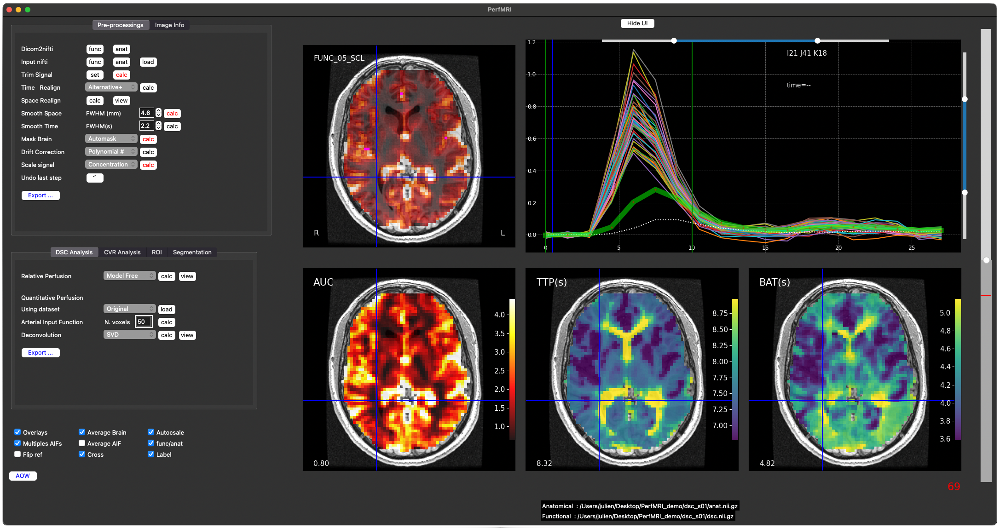
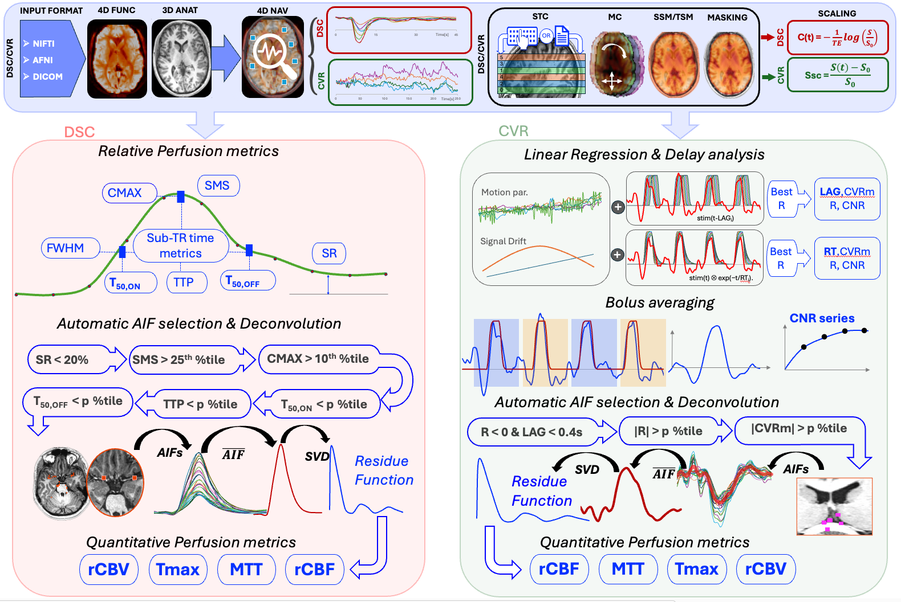

# PerfMRI GUI
Program to analyze MRI **DSC** perfusion, BOLD breath-hold, and **CVR** (cerebrovascular reactivity) datasets.

## Interface
<p align="center">
  
</p>

## Pipeline
<p align="center">
  
</p>

## Features

### Pre-processing
- Automask
- Slice-time correction
- Volume re-registration
- Signal detrending
- Signal scaling
- Spatial smoothing
- Temporal smoothing

### DSC Perfusion
- Relative perfusion metrics (**AUC**, **TTP**, **FWHM**, **BAT**)
- **TTP**, **BAT** maps have sub-TR temporal precision
- Automated AIF detection based on relative perfusion metrics
- Quantitative perfusion using SVD, oSVD, or model-based residue function (exponential)
- **rCBV, rCBF, MTT, Tmax** calculation

### Breath-Hold and CVR
- Input stimulus based on ON/OFF timing from a user-provided stimulus file:
  - One-column stimulus file (one value per TR)
  - Two-column stimulus file (time, value)
- Fast linear regression of BOLD signal against the stimulus
- Stimulus can be shifted left or right, with BOLD maps auto-recalculated to visualize the effect of lag
- Magnitude, partial correlation, **CNR** metrics
- **Lag** and **Response Time** metrics

### ROI 
- Drawing, loading and saving ROI
- Averaging metrics within ROI

### General Features
- Input formats: **NIfTI, DICOM, AFNI**
- (De-)oblique anatomical data to match functional obliquity
- Fast voxel navigation for data browsing
- Multiple colorscales available
- Automatic or manual color scale limits
- All maps can be automatically or manually exported
- Quick segmentation into grey matter, white matter, and CSF, subdivided into left and right hemisphere

## Installation Instructions (Mac & Linux)

### Download & Install
PerfMRI is installed inside its own Python virtual environment, so it will not affect your existing Python packages or system configuration.
    ```bash
    git clone https://github.com/julienpoublanc-uhn/PerfMRI.git
    cd PerfMRI
    chmod +x install_perfmri.sh run_perfmri.sh
    ./install_perfmri.sh
### Optional
#### For separating Left & Right hem.
    source perfmri_env/bin/activate
    pip install antspyx
### Run PerfMRI
    ./run_perfmri.sh


